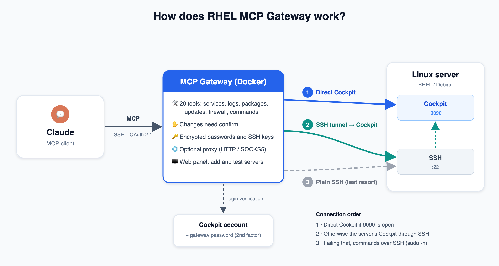

# RHEL MCP Gateway

[](https://github.com/bmericc/rhel-mcp-gateway/actions/workflows/tests.yml)

**English** · [Türkçe](README.tr.md)

A gateway that exposes RHEL servers to [Model Context Protocol (MCP)](https://modelcontextprotocol.io) clients (Claude etc.) through the [Cockpit](https://cockpit-project.org) running on them. An AI assistant can read the state of the servers, manage services/packages/firewall and run commands.



For a detailed description of the architecture and security: [Technical Overview](docs/overview.md)

- Commands run through **Cockpit** on the server. If the Cockpit port is not reachable from outside, Cockpit is reached through an **SSH tunnel**; if that fails too, commands run directly over **SSH**.
- Logging in to the gateway (web panel and MCP clients) is done with a **Cockpit account**. There is no separate user database.
- The web panel, error messages and MCP tool descriptions are in **English** by default and in **Turkish** when the browser asks for it (`Accept-Language`).

## Installation

```bash
cp sample.env .env      # edit the values
docker compose up -d --build
```

The gateway listens on port `7435`. Put a reverse proxy that terminates HTTPS (nginx, Caddy etc.) in front of it; the application honours the `X-Forwarded-*` headers.

Cockpit must be installed and running on the target servers:

```bash
sudo dnf install -y cockpit            # Debian/Ubuntu: sudo apt install -y cockpit
sudo systemctl enable --now cockpit.socket
```

If the gateway can reach the server over SSH, the Cockpit port (9090) does not need to be opened to the outside; Cockpit is reached through an SSH tunnel (see *Connection order*). If direct access is wanted, the port should only be opened to the gateway's IP address:

```bash
sudo firewall-cmd --permanent --add-rich-rule='rule family="ipv4" source address="GATEWAY_IP" port port="9090" protocol="tcp" accept' && sudo firewall-cmd --reload
# ufw: sudo ufw allow from GATEWAY_IP to any port 9090 proto tcp
```

### Environment variables (`.env`)

| Variable | Description |
| --- | --- |
| `SECRET_KEY` | Signs session cookies and encrypts Cockpit passwords. Must be long and random. **If it changes, stored Cockpit passwords can no longer be decrypted.** |
| `PORT` | Port to listen on (default `7435`) |
| `PUBLIC_URL` | The address the gateway is reached at from outside, e.g. `https://mcp.example.com`. OAuth redirects use it. |
| `COCKPIT_AUTH_URL` | The Cockpit that verifies logins. Default `https://host.docker.internal:9090` (the host machine the gateway runs on). |
| `COCKPIT_AUTH_VERIFY_TLS` | Whether to verify this Cockpit's certificate (default `false`) |
| `ALLOWED_USERS` | Cockpit users allowed into the gateway (comma separated). **If left empty, every user who can log in to Cockpit on that machine is allowed.** |
| `MCP_API_KEY` | **Access token** required in addition to the Cockpit login (second factor). Must be long and random. If empty, the Cockpit login alone is enough. Changing it ends all sessions. |
| `OUTBOUND_PROXY` | Optional. Default proxy for connections to the servers (`socks5://`, `socks5h://`, `http://`). See *Connection proxy*. |
| `SSH_LOGINS` | Users and key folders to try for SSH connections (tunnel and fallback). Default: `root:/root/.ssh,bmericc:/home/bmericc/.ssh` |
| `AUDIT_LOG_MAX_MB` | Maximum size of the audit log file (default `10`). See *Audit log*. |

`docker-compose.yml` gives access to the host machine under the name `host.docker.internal`. It also mounts the `/root/.ssh` and `/home/bmericc/.ssh` folders read-only.

## Logging in and connecting an MCP client

MCP endpoint: `https://<PUBLIC_URL>/sse`

The login has two parts: the **Cockpit username/password** and, if `MCP_API_KEY` is set, the **access token**. The token alone does not grant access. This way a weak Cockpit password is not enough on its own.

| Method | Usage |
| --- | --- |
| **OAuth 2.1** (recommended) | When the client connects, a login page opens in the browser: username, Cockpit password and gateway password (`MCP_API_KEY`). After login the client receives a token (1 hour; refresh token 30 days). |
| **HTTP Basic** | `Authorization: Basic base64(user:password)` + the access token (`X-MCP-Token: <token>` header or `?token=<token>`) |

If the gateway password is added to the MCP address (`https://<PUBLIC_URL>/sse?token=<MCP_API_KEY>`), the login page does not ask for it again; only the username and Cockpit password are requested. If it is missing or wrong, a second password field appears on the page. The same applies to the web panel (`/login?token=<token>`).

**claude.ai:** Enter `https://<PUBLIC_URL>/sse?token=<token>` under *Settings → Connectors → Add custom connector*. Log in with your Cockpit account on the page that opens while connecting.

**Claude Code:**

```bash
claude mcp add --transport sse rhel-gateway "https://<PUBLIC_URL>/sse?token=<token>"
```

OAuth flow endpoints:
- `/.well-known/oauth-protected-resource/sse`
- `/.well-known/oauth-authorization-server`
- `/register` (dynamic client registration)
- `/authorize` (PKCE)
- `/token`
- `/revoke`

Tokens are stored hashed in `data/oauth.json`.

## Adding servers

Log in to the web panel (`https://<PUBLIC_URL>/`) with your Cockpit account. Then fill in the *Add / Update Server* form:

| Field | Description |
| --- | --- |
| Server name, Host | Required |
| Cockpit user / password | The Cockpit account the commands run as. For administrative operations this user needs sudo rights. |
| Cockpit address | `https://HOST:9090` if empty |
| Verify TLS certificate | Leave off for self-signed certificates |
| SSH user / port / key path | For the Cockpit tunnel and the SSH fallback |
| Connection proxy | Optional, see *Connection proxy* |

Servers are kept in `data/servers.json`, which is not tracked by git. Cockpit passwords are encrypted in the file; the `list_servers` tool does not show passwords.

**Connection check:** Pressing Save really connects to the server and tries the routes in *Connection order*. If Cockpit works directly or through the SSH tunnel you get a ✓; if only plain SSH works the server is saved but shown with a ⚠ warning (and the reason Cockpit is not working). If no connection can be made at all, nothing is saved and an error is shown. If the server is down at the moment, the *Save without testing the connection* option can be used. The *Test* button in the server list retries the connection on demand and shows the latest status in the table.

**The gateway's public IP address:** The top of the panel shows the IP address the gateway reaches the internet from. This is the address that must be allowed in the firewall of remote servers for Cockpit (9090/tcp) and SSH (22/tcp) (if SSH is open, 9090 is not required since Cockpit can be used through the tunnel). The address is cached for 10 minutes; the *Refresh* button queries it again. Servers on the same local network see the local IP address of the machine running the gateway instead.

### Connection proxy

Cockpit and SSH connections to the servers can go through a proxy. The servers then see the proxy's IP address instead of the gateway's; allowing a single fixed address in the firewall is enough.

- **Default proxy:** set with `OUTBOUND_PROXY` in `.env` and applied to all servers.
- **Per server:** the *Connection proxy* field in the panel. An address such as `socks5://host:1080`, `direct` (no proxy) or `default` (back to the default) can be entered. If left empty, the current setting is kept.
- **Supported types:** `http://` (HTTP CONNECT), `socks5://` (target name resolved on the gateway), `socks5h://` (target name resolved on the proxy). A username/password can be given in the address; it is stored encrypted in the server records and the password is hidden in the panel and in `list_servers` output.
- **Egress IP:** if a default proxy is set, the panel also shows the egress IP address seen through the proxy.

### Shared SSH keys

In the *Shared SSH Keys* section of the panel a private key can be pasted (together with its passphrase if it has one) or a new Ed25519 key can be generated. These keys are tried for SSH connections (Cockpit tunnel and SSH fallback) on all servers, for every user, after the user's own `.ssh` keys. It is enough to add the public key line from the table to `~/.ssh/authorized_keys` on the servers. Private keys are stored in `data/ssh_keys.json` encrypted with `SECRET_KEY` and are not shown in the panel.

### Connection order

1. **Cockpit (direct):** if a Cockpit user is defined for the server, the Cockpit address is tried first. Administrative operations use Cockpit's superuser (sudo) mechanism.
2. **Cockpit (SSH tunnel):** if Cockpit cannot be reached (for example 9090 is closed in the firewall), the gateway connects to the server over SSH and opens a tunnel inside that connection to the server's own Cockpit (`localhost:9090`). Commands still run through Cockpit; the Cockpit port does not need to be opened to the outside. SSH port forwarding (`AllowTcpForwarding`, on by default) must not be disabled on the server.
3. **SSH:** if the tunnel cannot be established either, commands run directly over SSH. For non-root users, administrative commands run with `sudo -n` (passwordless sudo required).

Over SSH the user defined for the server is tried first, then the `SSH_LOGINS` order; for each user the shared keys are tried after their own keys.

- A failure to reach Cockpit directly is remembered for 10 minutes; during that time the tunnel is used without waiting for a timeout on every call.
- If Cockpit rejects the password, the tunnel is not tried and plain SSH is used directly.

Every tool output says which route was used: `"connection": {"via": "cockpit" | "cockpit-ssh" | "ssh"}`. If it fell back to SSH, the `cockpit_error` field says why Cockpit could not be used.

## MCP tools

**Read tools** (no confirmation needed):

| Tool | Description |
| --- | --- |
| `list_servers` | Registered servers |
| `fleet_health` | Load, failed services and root disk summary of all servers (in parallel) |
| `server_info` | Hostname, OS version, kernel, uptime |
| `resource_usage` | Memory, swap, load, CPU, disk usage |
| `service_status` | Service state and latest logs |
| `failed_services` | Failed systemd units |
| `read_logs` | `journalctl` (unit, time, priority, search filter) |
| `top_processes` | Processes using the most CPU/memory |
| `network_info` | IPs, routes, listening ports |
| `firewall_status` | firewalld state and rules |
| `selinux_status` | SELinux mode and recent denials |
| `available_updates` | Pending (security) updates |
| `package_info` | Whether a package is installed, and its version |

**Changing tools** (without `confirm: true` they only show what would be done):

| Tool | Description |
| --- | --- |
| `service_action` | start / stop / restart / reload / enable / disable |
| `install_updates` | `dnf upgrade` (optionally security only) |
| `package_install` / `package_remove` | Install / remove packages with dnf |
| `firewall_rule` | Add/remove a permanent port/service rule |
| `reboot_server` | Reboot |
| `run_remote_command` | Arbitrary command (administrator privileges with `as_root`) |

The package and firewall tools are for the RHEL family (`dnf`, `firewalld`). On Debian/Ubuntu servers `run_remote_command` can be used instead.

Inputs (service, package, port etc.) are validated. Commands are passed as argv, so they are not open to command injection. Outputs are returned as JSON, long outputs are truncated, and commands time out.

## Audit log

Every operation done through the gateway is recorded and shown on the *Audit log* page (`/logs`) of the panel:

- **MCP tool calls:** who (user, IP), which tool, which server, the parameters, the commands run on the server (connection route, user, exit code), the result and the duration. Calls that were not executed because `confirm: true` was not given appear as *awaiting confirmation*.
- **MCP connections:** successful connections and rejected credentials.
- **Panel actions:** login (successful/failed), logout, adding/updating/testing/deleting servers, adding/generating/deleting shared SSH keys.

The page has a text search and user, server, source (MCP / panel) and status filters; the newest entry is on top.

Entries are kept in `data/audit.log`, one JSON object per line (file mode `600`). When the file reaches `AUDIT_LOG_MAX_MB` it is rotated to `data/audit.log.1` and a new one is started; only one backup is kept. Passwords, access tokens and private keys are not recorded. **The commands that were run and their output (truncated to 4000 characters per field) are recorded**; secrets written into a command or its output end up in the log too. Messages are recorded in the language of the request that caused them.

## Interface language

The language is chosen per request from the browser's `Accept-Language` header: Turkish if the browser prefers it, English otherwise. This covers the web panel, login pages, error messages, and MCP tool descriptions and messages (MCP clients normally send no `Accept-Language`, so they get English).

Source strings are English; the Turkish translations live in [`public-gateway/i18n.py`](public-gateway/i18n.py). To add a string, wrap it in `t("...")` and add its translation to the `TR` dictionary; a test fails if a translation is missing.

## Development and tests

```bash
cd public-gateway
pip install -r requirements-dev.txt
python -m pytest
```

- The tests do not connect to real servers. SSH is mocked; for Cockpit, `tests/fake_cockpit.py` contains a fake server written after the behaviour of the real cockpit-ws.
- Testing against a real Cockpit:

  ```bash
  COCKPIT_TEST_URL=https://host:9090 COCKPIT_TEST_USER=... COCKPIT_TEST_PASSWORD=... python -m pytest tests/test_cockpit_real.py
  ```
- GitHub Actions runs the tests with Python 3.11 on every push and PR.

> The `mcp` package is pinned to `<2`; the code uses the mcp 1.x API.

## Security notes

- Always set `ALLOWED_USERS`. The gateway can perform operations with administrator privileges on the registered servers.
- Choose a long and random `MCP_API_KEY` (e.g. `openssl rand -hex 32`). Even if the Cockpit password is weak, nobody can log in without the token. If the token is wrong, the password is never sent to Cockpit.
- TLS verification is off by default for Cockpit connections (for self-signed certificates); it is never verified for the Cockpit connection inside the SSH tunnel. The server key is not verified for SSH (`known_hosts=None`). These assume a trusted network.
- Keep `SECRET_KEY` secret and do not change it.

## Components

| Folder | Description |
| --- | --- |
| `public-gateway/` | MCP server, OAuth authorization, web panel, Cockpit and SSH clients |
| `internal-agent/` | An agent planned to connect to the gateway over WebSocket. **Not used yet.** |

## License

[GNU GPL v3](LICENSE)
