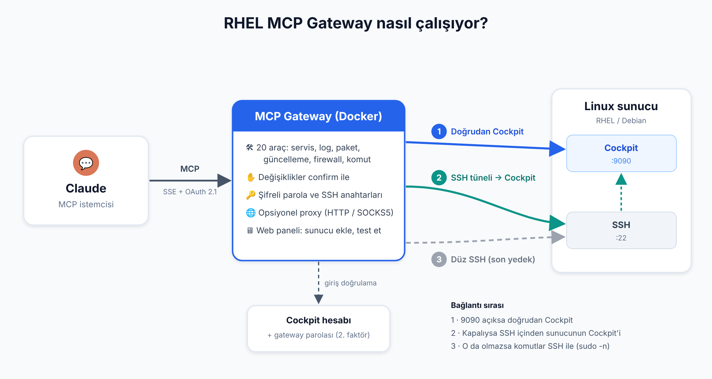

# RHEL MCP Gateway

[](https://github.com/bmericc/rhel-mcp-gateway/actions/workflows/tests.yml)

[English](README.md) · **Türkçe**

RHEL sunucularını, üzerlerindeki [Cockpit](https://cockpit-project.org) aracılığıyla [Model Context Protocol (MCP)](https://modelcontextprotocol.io) istemcilerine (Claude vb.) açan bir gateway. Yapay zekâ asistanı sunucuların durumunu okuyabilir, servis/paket/firewall yönetebilir ve komut çalıştırabilir.



Ayrıntılı mimari ve güvenlik açıklaması için: [Teknik Genel Bakış](docs/genel-bakis.md)

- Komutlar sunucudaki **Cockpit** üzerinden çalışır. Cockpit portuna dışarıdan ulaşılamazsa Cockpit'e **SSH tüneli** içinden bağlanılır; o da olmazsa komutlar doğrudan **SSH** ile çalışır.
- Gateway'e giriş (web paneli ve MCP istemcileri) **Cockpit hesabıyla** yapılır. Ayrı bir kullanıcı veritabanı yoktur.
- Web paneli, hata mesajları ve MCP araç açıklamaları varsayılan olarak **İngilizce**dir; tarayıcı Türkçe istiyorsa (`Accept-Language`) **Türkçe** gösterilir.

## Kurulum

```bash
cp sample.env .env      # değerleri düzenleyin
docker compose up -d --build
```

Gateway `7435` portunda çalışır. Önüne HTTPS sonlandıran bir reverse proxy (nginx, Caddy vb.) koyun; uygulama `X-Forwarded-*` başlıklarını dikkate alır.

Hedef sunucularda Cockpit kurulu ve çalışır olmalı:

```bash
sudo dnf install -y cockpit            # Debian/Ubuntu: sudo apt install -y cockpit
sudo systemctl enable --now cockpit.socket
```

Gateway sunucuya SSH ile bağlanabiliyorsa Cockpit portunu (9090) dışarıya açmak gerekmez; Cockpit'e SSH tüneli içinden ulaşılır (bkz. *Bağlantı sırası*). Doğrudan erişim istenirse port yalnızca gateway'in IP adresine açılmalı:

```bash
sudo firewall-cmd --permanent --add-rich-rule='rule family="ipv4" source address="GATEWAY_IP" port port="9090" protocol="tcp" accept' && sudo firewall-cmd --reload
# ufw: sudo ufw allow from GATEWAY_IP to any port 9090 proto tcp
```

### Ortam değişkenleri (`.env`)

| Değişken | Açıklama |
| --- | --- |
| `SECRET_KEY` | Oturum çerezlerini imzalar, Cockpit şifrelerini şifreler. Uzun ve rastgele olmalı. **Değiştirilirse kayıtlı Cockpit şifreleri çözülemez.** |
| `PORT` | Dinlenecek port (varsayılan `7435`) |
| `PUBLIC_URL` | Gateway'in dışarıdan erişilen adresi, örn. `https://mcp.ornek.com`. OAuth yönlendirmeleri bunu kullanır. |
| `COCKPIT_AUTH_URL` | Girişleri doğrulayacak Cockpit. Varsayılan `https://host.docker.internal:9090` (gateway'in çalıştığı host makine). |
| `COCKPIT_AUTH_VERIFY_TLS` | Bu Cockpit'in sertifikası doğrulansın mı (varsayılan `false`) |
| `ALLOWED_USERS` | Gateway'e girebilecek Cockpit kullanıcıları (virgülle). **Boş bırakılırsa o makinede Cockpit'e girebilen her kullanıcı girebilir.** |
| `MCP_API_KEY` | Cockpit girişine ek olarak istenen **erişim token'ı** (ikinci faktör). Uzun ve rastgele olmalı. Boşsa yalnızca Cockpit girişi yeter. Değiştirilirse tüm oturumlar kapanır. |
| `OUTBOUND_PROXY` | Opsiyonel. Sunuculara giden bağlantılar için varsayılan proxy (`socks5://`, `socks5h://`, `http://`). Bkz. *Bağlantı proxy'si*. |
| `SSH_LOGINS` | SSH bağlantılarında (tünel ve yedek) denenecek kullanıcılar ve key klasörleri. Varsayılan: `root:/root/.ssh,bmericc:/home/bmericc/.ssh` |
| `AUDIT_LOG_MAX_MB` | İşlem kayıt dosyasının en fazla boyutu (varsayılan `10`). Bkz. *İşlem kayıtları*. |

`docker-compose.yml`, host makineye `host.docker.internal` adıyla erişim sağlar. Ayrıca `/root/.ssh` ve `/home/bmericc/.ssh` klasörlerini salt okunur bağlar.

## Giriş ve MCP istemcisine bağlanma

MCP uç noktası: `https://<PUBLIC_URL>/sse`

Giriş iki parçalıdır: **Cockpit kullanıcı adı/şifresi** ve `MCP_API_KEY` tanımlıysa **erişim token'ı**. Token tek başına giriş sağlamaz. Böylece zayıf bir Cockpit şifresi tek başına yetmez.

| Yöntem | Kullanım |
| --- | --- |
| **OAuth 2.1** (önerilen) | İstemci bağlanınca tarayıcıda giriş sayfası açılır: kullanıcı adı, Cockpit parolası ve gateway parolası (`MCP_API_KEY`). Giriş yapılınca istemci token alır (1 saat; refresh token 30 gün). |
| **HTTP Basic** | `Authorization: Basic base64(kullanıcı:şifre)` + erişim token'ı (`X-MCP-Token: <token>` başlığı veya `?token=<token>`) |

Gateway parolası MCP adresine eklenirse (`https://<PUBLIC_URL>/sse?token=<MCP_API_KEY>`) giriş sayfası onu ayrıca sormaz; yalnızca kullanıcı adı ve Cockpit parolası istenir. Adreste yoksa veya yanlışsa sayfada ikinci parola alanı çıkar. Web panelinde de aynısı geçerlidir (`/login?token=<token>`).

**claude.ai:** *Settings → Connectors → Add custom connector* bölümüne `https://<PUBLIC_URL>/sse?token=<token>` adresini girin. Bağlanırken açılan sayfada Cockpit hesabınızla giriş yapın.

**Claude Code:**

```bash
claude mcp add --transport sse rhel-gateway "https://<PUBLIC_URL>/sse?token=<token>"
```

OAuth akışı uç noktaları:
- `/.well-known/oauth-protected-resource/sse`
- `/.well-known/oauth-authorization-server`
- `/register` (dinamik istemci kaydı)
- `/authorize` (PKCE)
- `/token`
- `/revoke`

Token'lar `data/oauth.json` dosyasında hash'lenmiş olarak saklanır.

## Sunucu ekleme

Web panelinde (`https://<PUBLIC_URL>/`) Cockpit hesabınızla giriş yapın. Ardından *Sunucu Ekle / Güncelle* formunu doldurun:

| Alan | Açıklama |
| --- | --- |
| Sunucu adı, Host | Zorunlu |
| Cockpit kullanıcısı / şifresi | Komutların çalışacağı Cockpit hesabı. Yönetici işlemleri için bu kullanıcının sudo yetkisi olmalı. |
| Cockpit adresi | Boşsa `https://HOST:9090` |
| TLS sertifikasını doğrula | Kendinden imzalı sertifikada kapalı bırakın |
| SSH kullanıcısı / portu / key yolu | Cockpit tüneli ve SSH yedeği için |
| Bağlantı proxy'si | Opsiyonel, bkz. *Bağlantı proxy'si* |

Sunucular `data/servers.json` dosyasında tutulur ve bu dosya git'e alınmaz. Cockpit şifreleri dosyada şifrelidir; `list_servers` aracı şifreleri göstermez.

**Bağlantı kontrolü:** Kaydet'e basınca sunucuya gerçekten bağlanılır ve *Bağlantı sırası*ndaki yollar denenir. Cockpit doğrudan ya da SSH tüneliyle çalışıyorsa ✓, yalnızca düz SSH çalışıyorsa sunucu kaydedilir ama ⚠ ile uyarı (ve Cockpit'in neden çalışmadığı) gösterilir. Hiç bağlantı kurulamazsa kayıt yapılmaz ve hata gösterilir. Sunucu o an kapalıysa *Bağlantıyı test etmeden kaydet* seçeneği kullanılabilir. Sunucu listesindeki *Test et* düğmesi bağlantıyı istendiği zaman yeniden dener ve son durumu tabloda gösterir.

**Gateway'in dış IP adresi:** Panelin üstünde gateway'in internete çıktığı IP adresi gösterilir. Bu, uzaktaki sunucuların güvenlik duvarında Cockpit (9090/tcp) ve SSH (22/tcp) için izin verilmesi gereken adrestir (SSH açıksa Cockpit tünelden kullanılabildiği için 9090 zorunlu değildir). Adres 10 dakika önbelleklenir; *Yenile* düğmesiyle tekrar sorgulanabilir. Aynı yerel ağdaki sunucular ise gateway'i çalıştıran makinenin yerel IP adresini görür.

### Bağlantı proxy'si

Sunuculara giden Cockpit ve SSH bağlantıları bir proxy üzerinden yapılabilir. Böylece sunucular gateway yerine proxy'nin IP adresini görür; güvenlik duvarında tek bir sabit adrese izin vermek yeterli olur.

- **Varsayılan proxy:** `.env`'de `OUTBOUND_PROXY` ile tanımlanır ve tüm sunuculara uygulanır.
- **Sunucu bazında:** panelde *Bağlantı proxy'si* alanı. `socks5://host:1080` gibi bir adres, `direct` (proxysiz) ya da `default` (varsayılana dön) yazılabilir. Boş bırakılırsa mevcut ayar korunur.
- **Desteklenen türler:** `http://` (HTTP CONNECT), `socks5://` (hedef adı gateway'de çözülür), `socks5h://` (hedef adı proxy'de çözülür). Kullanıcı adı/parola adreste verilebilir; sunucu kayıtlarında şifreli saklanır, panelde ve `list_servers` çıktısında parola gizlenir.
- **Çıkış IP'si:** varsayılan proxy tanımlıysa panel, proxy üzerinden görünen çıkış IP adresini de gösterir.

### Ortak SSH anahtarları

Panelin *Ortak SSH Anahtarları* bölümünden bir özel anahtar yapıştırılabilir (parolalıysa anahtar parolasıyla birlikte) ya da yeni bir Ed25519 anahtarı üretilebilir. Bu anahtarlar SSH bağlantılarında (Cockpit tüneli ve SSH yedeği) tüm sunucularda, her kullanıcı için, kullanıcının kendi `.ssh` anahtarlarından sonra denenir. Tablodaki açık anahtar satırını sunuculardaki `~/.ssh/authorized_keys` dosyasına eklemeniz yeterlidir. Özel anahtarlar `data/ssh_keys.json` içinde `SECRET_KEY` ile şifreli saklanır ve panelde gösterilmez.

### Bağlantı sırası

1. **Cockpit (doğrudan):** sunucuda Cockpit kullanıcısı tanımlıysa önce Cockpit adresine bağlanılır. Yönetici işlemleri Cockpit'in superuser (sudo) mekanizmasıyla yapılır.
2. **Cockpit (SSH tüneli):** Cockpit'e ulaşılamazsa (örneğin 9090 güvenlik duvarında kapalıysa) sunucuya SSH ile bağlanılır ve bağlantının içinden sunucunun kendi Cockpit'ine (`localhost:9090`) tünel açılır. Komutlar yine Cockpit üzerinden çalışır; Cockpit portunu dışarıya açmak gerekmez. Sunucuda SSH port yönlendirmesi (`AllowTcpForwarding`, varsayılan açık) kapalı olmamalı.
3. **SSH:** tünel de kurulamazsa komutlar doğrudan SSH ile çalışır. Root olmayan kullanıcıda yönetici komutları `sudo -n` ile (parolasız sudo gerekir) çalışır.

SSH'ta önce sunucuya tanımlı kullanıcı, sonra `SSH_LOGINS` sırası denenir; her kullanıcı için kendi anahtarlarından sonra ortak anahtarlar denenir.

- Doğrudan Cockpit'e ulaşılamadığı 10 dakika hatırlanır; bu sürede her çağrıda zaman aşımı beklenmeden tünel kullanılır.
- Cockpit şifreyi reddederse tünel denenmez, doğrudan SSH'a geçilir.

Her araç çıktısında hangi yolla bağlanıldığı yazar: `"connection": {"via": "cockpit" | "cockpit-ssh" | "ssh"}`. SSH'a düşüldüyse `cockpit_error` alanında Cockpit'in neden kullanılamadığı yer alır.

## MCP araçları

**Okuma araçları** (onay gerekmez):

| Araç | Açıklama |
| --- | --- |
| `list_servers` | Kayıtlı sunucular |
| `fleet_health` | Tüm sunucuların yük, çökmüş servis ve kök disk özeti (paralel) |
| `server_info` | Hostname, OS sürümü, kernel, uptime |
| `resource_usage` | Bellek, swap, yük, CPU, disk doluluğu |
| `service_status` | Servis durumu ve son loglar |
| `failed_services` | Çökmüş systemd unit'leri |
| `read_logs` | `journalctl` (unit, zaman, öncelik, arama filtresi) |
| `top_processes` | En çok CPU/bellek kullanan süreçler |
| `network_info` | IP'ler, rotalar, dinlenen portlar |
| `firewall_status` | firewalld durumu ve kurallar |
| `selinux_status` | SELinux modu ve son engellemeler |
| `available_updates` | Bekleyen (güvenlik) güncellemeleri |
| `package_info` | Paket kurulu mu, sürümü |

**Değiştiren araçlar** (`confirm: true` olmadan yalnızca ne yapılacağını gösterir):

| Araç | Açıklama |
| --- | --- |
| `service_action` | start / stop / restart / reload / enable / disable |
| `install_updates` | `dnf upgrade` (opsiyonel yalnızca güvenlik) |
| `package_install` / `package_remove` | dnf ile paket kur / kaldır |
| `firewall_rule` | Kalıcı port/servis kuralı ekle/kaldır |
| `reboot_server` | Yeniden başlat |
| `run_remote_command` | Serbest komut (`as_root` ile yönetici yetkisi) |

Paket ve güvenlik duvarı araçları RHEL ailesi içindir (`dnf`, `firewalld`). Debian/Ubuntu sunucularda bunlar yerine `run_remote_command` kullanılabilir.

Girdiler (servis, paket, port vb.) doğrulanır. Komutlar argv olarak verildiği için komut enjeksiyonuna kapalıdır. Çıktılar JSON döner, uzun çıktılar kırpılır, komutlar zaman aşımına uğrar.

## İşlem kayıtları

Gateway üzerinden yapılan her işlem kaydedilir ve panelde *İşlem kayıtları* sayfasında (`/logs`) gösterilir:

- **MCP araç çağrıları:** kim (kullanıcı, IP), hangi araç, hangi sunucu, parametreler, sunucuda çalıştırılan komutlar (bağlantı yolu, kullanıcı, çıkış kodu), sonuç ve süre. `confirm: true` verilmediği için çalıştırılmayan çağrılar *onay bekliyor* olarak görünür.
- **MCP bağlantıları:** başarılı bağlantılar ve reddedilen kimlik bilgileri.
- **Panel işlemleri:** giriş (başarılı/başarısız), çıkış, sunucu ekleme/güncelleme/test/silme, ortak SSH anahtarı ekleme/üretme/silme.

Sayfada metin araması ile kullanıcı, sunucu, kaynak (MCP / panel) ve durum filtreleri vardır; en yeni kayıt üsttedir.

Kayıtlar `data/audit.log` dosyasında, her satırı bir JSON nesnesi olacak şekilde tutulur (dosya izni `600`). Dosya `AUDIT_LOG_MAX_MB` boyutuna ulaşınca `data/audit.log.1` olarak yedeklenir ve yenisi başlatılır; yalnızca bir yedek tutulur. Şifreler, erişim token'ları ve özel anahtarlar kaydedilmez. **Çalıştırılan komutlar ve çıktıları (alan başına 4000 karaktere kırpılarak) kaydedilir**; komuta ya da çıktıya yazılan gizli bilgiler kayıtta da yer alır. Mesajlar, işlemi yapan isteğin diliyle kaydedilir.

## Arayüz dili

Dil her istekte tarayıcının `Accept-Language` başlığından seçilir: tarayıcı Türkçeyi tercih ediyorsa Türkçe, aksi hâlde İngilizce. Bu; web panelini, giriş sayfalarını, hata mesajlarını ve MCP araç açıklamaları ile mesajlarını kapsar (MCP istemcileri genellikle `Accept-Language` göndermediği için İngilizce alır).

Kaynak metinler İngilizcedir; Türkçe çeviriler [`public-gateway/i18n.py`](public-gateway/i18n.py) içindedir. Yeni bir metin eklerken `t("...")` ile sarın ve çevirisini `TR` sözlüğüne ekleyin; çevirisi eksikse bir test hata verir.

## Geliştirme ve testler

```bash
cd public-gateway
pip install -r requirements-dev.txt
python -m pytest
```

- Testler gerçek sunuculara bağlanmaz. SSH taklit edilir; Cockpit için `tests/fake_cockpit.py` içinde gerçek cockpit-ws davranışına göre yazılmış bir sahte sunucu kullanılır.
- Gerçek bir Cockpit'e karşı test:

  ```bash
  COCKPIT_TEST_URL=https://host:9090 COCKPIT_TEST_USER=... COCKPIT_TEST_PASSWORD=... python -m pytest tests/test_cockpit_real.py
  ```
- GitHub Actions her push ve PR'da testleri Python 3.11 ile çalıştırır.

> `mcp` paketi `<2` sürümüne sabitlenmiştir; kod mcp 1.x API'sini kullanır.

## Güvenlik notları

- `ALLOWED_USERS`'ı mutlaka doldurun. Gateway, kayıtlı sunucularda yönetici yetkisiyle işlem yapabilir.
- `MCP_API_KEY`'i uzun ve rastgele seçin (örn. `openssl rand -hex 32`). Cockpit şifresi zayıf olsa bile token olmadan giriş yapılamaz. Token yanlışsa şifre Cockpit'e hiç gönderilmez.
- Cockpit bağlantılarında TLS doğrulaması varsayılan olarak kapalıdır (kendinden imzalı sertifikalar için); SSH tüneli içindeki Cockpit bağlantısında hiç doğrulanmaz. SSH'ta sunucu anahtarı doğrulanmaz (`known_hosts=None`). Bunlar güvenilir ağ varsayar.
- `SECRET_KEY`'i gizli tutun ve değiştirmeyin.

## Bileşenler

| Klasör | Açıklama |
| --- | --- |
| `public-gateway/` | MCP sunucusu, OAuth yetkilendirme, web paneli, Cockpit ve SSH istemcileri |
| `internal-agent/` | WebSocket ile gateway'e bağlanması planlanan ajan. **Henüz kullanılmıyor.** |

## Lisans

[GNU GPL v3](LICENSE)
