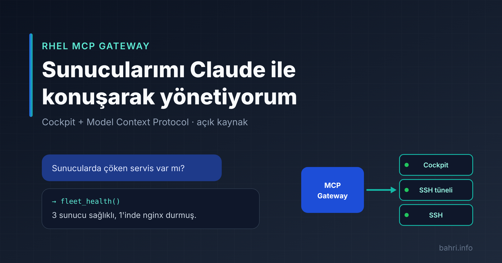

# RHEL MCP Gateway — Teknik Genel Bakış



| | |
| --- | --- |
| **Belge türü** | Ürün ve mimari genel bakış |
| **Kapsam** | `public-gateway` bileşeni |
| **Lisans** | GNU GPL v3 |
| **Kaynak kod** | <https://github.com/bmericc/rhel-mcp-gateway> |

## 1. Yönetici özeti

RHEL MCP Gateway, Linux sunucu filolarının yapay zekâ asistanları tarafından güvenli ve denetimli biçimde yönetilmesini sağlayan açık kaynaklı bir ara katmandır. Sunucularda zaten kullanılan **Cockpit** yönetim arayüzünü, yapay zekâ istemcilerinin ortak standardı olan **Model Context Protocol (MCP)** ile buluşturur.

Böylece sistem yöneticileri sunucuların durumunu, servisleri, logları ve güncellemeleri doğal dille sorgulayabilir, değişiklik gerektiren işlemleri onay mekanizmasıyla yaptırabilir. Çözüm, sunuculara ek ajan veya eklenti kurulmasını gerektirmez; mevcut Cockpit ve SSH altyapısını kullanır.

**Başlıca faydalar:**

- **Hızlı teşhis:** Birden çok sunucunun sağlık durumu tek bir soruyla paralel olarak toplanır.
- **Kontrollü değişiklik:** Sistemi değiştiren her işlem açık onay olmadan yalnızca önizleme olarak gösterilir.
- **Mevcut altyapıyla uyum:** Kimlik doğrulama ve yetki yükseltme Cockpit'in kendi mekanizmalarıyla yapılır; ayrı bir kullanıcı veritabanı yoktur.
- **Esnek ağ erişimi:** Doğrudan erişim, SSH tüneli, SSH yedeği ve proxy seçenekleriyle farklı ağ koşullarına uyum sağlar.

## 2. Amaç ve kapsam

Gateway'in amacı, MCP uyumlu istemcilere (Claude, Claude Code vb.) kayıtlı Linux sunucuları üzerinde **sınırlandırılmış ve denetlenebilir** bir araç seti sunmaktır.

**Kapsam içinde:**

- Sunucu durumunun okunması: sistem bilgisi, kaynak kullanımı, servisler, loglar, ağ, güvenlik duvarı, SELinux, güncellemeler.
- Onaylı değişiklikler: servis yönetimi, paket kurulumu ve kaldırılması, güncelleme, güvenlik duvarı kuralları, yeniden başlatma, serbest komut.
- Sunucu envanterinin yönetimi için web paneli.

**Kapsam dışında:**

- Sunuculara ajan veya Cockpit eklentisi kurulması.
- Yapılandırma yönetimi araçlarının (Ansible, Puppet vb.) yerini almak.
- Çok kiracılı (multi-tenant) kullanım.

## 3. Mimari


Gateway tek bir Docker konteyneri olarak çalışan bir Python (FastAPI) uygulamasıdır. Üç ana arayüzü vardır:

| Arayüz | Protokol | Kullanan |
| --- | --- | --- |
| MCP uç noktası (`/sse`) | MCP, SSE taşıması, OAuth 2.1 | Yapay zekâ istemcileri |
| Web paneli (`/`) | HTTPS (reverse proxy arkasında) | Sistem yöneticileri |
| Sunucu bağlantıları | Cockpit WebSocket (`cockpit1`), SSH | Gateway → sunucular |

### 3.1 Bileşenler

| Modül | Sorumluluk |
| --- | --- |
| `main.py` | MCP sunucusu, web paneli, sunucu envanteri, bağlantı seçimi |
| `auth.py` | Cockpit tabanlı kimlik doğrulama, OAuth 2.1 yetkilendirme sunucusu |
| `cockpit_client.py` | Cockpit WebSocket protokol istemcisi |
| `fleet_tools.py` | MCP araçları, girdi doğrulama, çıktı ayrıştırma |
| `outbound_proxy.py` | HTTP CONNECT ve SOCKS5 proxy istemcisi |

### 3.2 Bağlantı modeli

Gateway her sunucuya aşağıdaki sırayla bağlanmayı dener:

1. **Doğrudan Cockpit:** Cockpit adresine (varsayılan `https://HOST:9090`) bağlanılır. Yönetici işlemleri Cockpit'in superuser mekanizmasıyla yapılır.
2. **SSH tüneli üzerinden Cockpit:** Cockpit portuna dışarıdan ulaşılamıyorsa sunucuya SSH ile bağlanılır. Bağlantının içinden sunucunun kendi `localhost` Cockpit'ine tünel açılır. Böylece Cockpit portunun dışarıya açılması gerekmez.
3. **SSH:** Tünel kurulamazsa komutlar doğrudan SSH ile çalıştırılır. Root olmayan kullanıcılarda yönetici komutları `sudo -n` ile çalışır.

Doğrudan Cockpit erişimindeki başarısızlık 10 dakika boyunca hatırlanır; bu sürede gereksiz zaman aşımı beklenmeden tünele geçilir. Her araç yanıtında kullanılan bağlantı yolu (`cockpit`, `cockpit-ssh`, `ssh`) belirtilir.

### 3.3 Ağ ve proxy desteği

- Sunuculara giden tüm bağlantılar isteğe bağlı olarak bir proxy üzerinden yönlendirilebilir (HTTP CONNECT, SOCKS5, SOCKS5h). Proxy genel olarak ya da sunucu bazında tanımlanabilir.
- Web paneli, gateway'in ve tanımlı proxy'nin dış IP adresini göstererek güvenlik duvarı kurallarının hazırlanmasını kolaylaştırır.

## 4. Kimlik doğrulama ve yetkilendirme

### 4.1 Kullanıcı girişi

Gateway'e giriş, gateway'in çalıştığı makinedeki (veya yapılandırılan) Cockpit hesabıyla doğrulanır. Ek olarak, yapılandırmada tanımlanan bir **erişim token'ı** (`MCP_API_KEY`) ikinci faktör olarak istenir.

- Token tek başına giriş sağlamaz.
- Token yanlışsa kullanıcı parolası Cockpit'e iletilmez.
- `ALLOWED_USERS` ile gateway'e erişebilecek kullanıcılar sınırlandırılabilir.

### 4.2 MCP istemcileri

| Yöntem | Açıklama |
| --- | --- |
| OAuth 2.1 (önerilen) | Dinamik istemci kaydı (RFC 7591), PKCE, refresh token rotasyonu, token iptali, korumalı kaynak metaverisi (RFC 9728). Erişim token'ı 1 saat, refresh token 30 gün geçerlidir. |
| HTTP Basic | Cockpit kullanıcı adı/parolası ve erişim token'ı başlıkta gönderilir. |

Token'lar sunucu tarafında yalnızca SHA-256 özetleri olarak saklanır. Erişim token'ı değiştirildiğinde mevcut tüm oturumlar geçersiz olur.

### 4.3 Sunuculardaki yetki

Gateway, her sunucu için tanımlanan Cockpit hesabının yetkileriyle çalışır. Yönetici yetkisi gerektiren işlemler için bu hesabın sudo yetkisi olmalıdır. SSH yedeğinde parolasız sudo (`sudo -n`) gerekir.

## 5. Yetenekler

### 5.1 Okuma araçları

| Araç | İşlev |
| --- | --- |
| `list_servers` | Kayıtlı sunucular (parolalar gizlenir) |
| `fleet_health` | Tüm sunucuların yük, çökmüş servis ve disk özeti (paralel) |
| `server_info` | Hostname, işletim sistemi, kernel, çalışma süresi |
| `resource_usage` | Bellek, swap, yük, CPU, disk doluluğu |
| `service_status` | Servis durumu ve son log satırları |
| `failed_services` | Başarısız systemd birimleri |
| `read_logs` | `journalctl` (birim, zaman, öncelik ve arama filtresi) |
| `top_processes` | En çok kaynak tüketen süreçler |
| `network_info` | IP adresleri, rotalar, dinlenen portlar |
| `firewall_status` | firewalld durumu ve kuralları |
| `selinux_status` | SELinux modu ve son engellemeler |
| `available_updates` | Bekleyen (güvenlik) güncellemeleri |
| `package_info` | Paket kurulum durumu ve sürümü |

### 5.2 Değişiklik araçları

| Araç | İşlev |
| --- | --- |
| `service_action` | Servis başlatma, durdurma, yeniden başlatma, yeniden yükleme, etkinleştirme, devre dışı bırakma |
| `install_updates` | Paket güncellemelerinin kurulumu (isteğe bağlı yalnızca güvenlik) |
| `package_install` / `package_remove` | Paket kurulumu ve kaldırılması |
| `firewall_rule` | Kalıcı port veya servis kuralı ekleme/kaldırma |
| `reboot_server` | Sunucunun yeniden başlatılması |
| `run_remote_command` | Serbest komut (isteğe bağlı yönetici yetkisiyle) |

Değişiklik araçları `confirm: true` parametresi olmadan çalıştırılmaz; bu durumda yalnızca yapılacak işlemin önizlemesi döner.

> Paket ve güvenlik duvarı araçları RHEL ailesi (`dnf`, `firewalld`) için tasarlanmıştır. Diğer dağıtımlarda bu işlemler `run_remote_command` ile yapılabilir.

## 6. Güvenlik

### 6.1 Uygulanan kontroller

| Alan | Kontrol |
| --- | --- |
| Kimlik doğrulama | Cockpit hesabı ve erişim token'ı ile iki faktör; izinli kullanıcı listesi |
| Oturumlar | OAuth 2.1 ve PKCE; token'lar özet olarak saklanır; token değişiminde oturumlar sıfırlanır |
| Gizli bilgiler | Cockpit parolaları, proxy kimlik bilgileri ve ortak SSH anahtarları `SECRET_KEY`'den türetilen anahtarla (Fernet) şifreli saklanır; dosya izinleri `0600` |
| Komut güvenliği | Komutlar argv dizisi olarak iletilir (kabuk yorumlaması yok); servis, paket ve port girdileri doğrulanır |
| Değişiklik denetimi | Değiştiren işlemler açık onay gerektirir |
| Kaynak sınırları | Komutlar zaman aşımına tabidir (varsayılan 60 sn, uzun işlemler 15 dk); çıktılar 20.000 karakterle sınırlandırılır |
| Ağ | Sunucu bağlantısında hata olursa güvenli tarafta kalınır (örneğin proxy ayarı çözülemezse doğrudan bağlantıya düşülmez) |

### 6.2 Bilinen sınırlamalar

- Cockpit bağlantılarında TLS sertifika doğrulaması varsayılan olarak kapalıdır (kendinden imzalı sertifikalar nedeniyle). SSH tüneli içindeki Cockpit bağlantısında sertifika doğrulanmaz.
- SSH bağlantılarında sunucu anahtarı doğrulanmaz (`known_hosts` kullanılmaz).
- Bu nedenlerle çözüm, gateway ile sunucular arasındaki ağın güvenilir olduğu varsayımıyla tasarlanmıştır.

### 6.3 Önerilen işletim uygulamaları

- `ALLOWED_USERS` mutlaka tanımlanmalı, erişim token'ı uzun ve rastgele seçilmelidir (örn. `openssl rand -hex 32`).
- Gateway HTTPS sonlandıran bir reverse proxy arkasında yayınlanmalıdır.
- Sunucularda Cockpit portu dışarıya açılmamalı, mümkünse SSH tüneli kullanılmalıdır. Açılması gerekiyorsa yalnızca gateway'in IP adresine izin verilmelidir.
- `SECRET_KEY` gizli tutulmalı ve değiştirilmemelidir; değiştirilirse saklanan parolalar çözülemez.

## 7. Kurulum ve işletim

**Gereksinimler:**

- Docker ve Docker Compose
- HTTPS sonlandıran bir reverse proxy (nginx, Caddy vb.)
- Hedef sunucularda Cockpit (`cockpit.socket`) ve/veya SSH erişimi

**Kurulum:**

```bash
git clone https://github.com/bmericc/rhel-mcp-gateway
cd rhel-mcp-gateway
cp sample.env .env      # yapılandırma değerlerini düzenleyin
docker compose up -d --build
```

**Kalıcı veriler** (`data/` klasörü):

| Dosya | İçerik |
| --- | --- |
| `servers.json` | Sunucu envanteri (parolalar şifreli) |
| `oauth.json` | OAuth istemcileri ve token özetleri |
| `ssh_keys.json` | Ortak SSH anahtarları (şifreli) |

Yapılandırma değişkenlerinin tam listesi için [README](../README.md#ortam-değişkenleri-env) dosyasına bakınız.

## 8. Kalite güvencesi

- Kod tabanı 200'ün üzerinde otomatik testle doğrulanır. Testler gerçek sunuculara bağlanmaz; Cockpit için gerçek cockpit-ws davranışını taklit eden bir test sunucusu, SSH için sahte bağlantılar kullanılır.
- OAuth akışı, SSH tüneli ve proxy desteği ayrıca gerçek cockpit-ws ve OpenSSH sunucularına karşı doğrulanmıştır.
- GitHub Actions her değişiklikte testleri çalıştırır; GitGuardian ile gizli bilgi taraması yapılır.

## 9. Yol haritası

- Debian/Ubuntu ailesi için paket (`apt`) ve güvenlik duvarı (`ufw`) araçları.
- SSH sunucu anahtarı doğrulaması ve sıkılaştırılmış TLS ayarları.

## 10. Lisans

Bu yazılım [GNU General Public License v3](../LICENSE) ile lisanslanmıştır.
