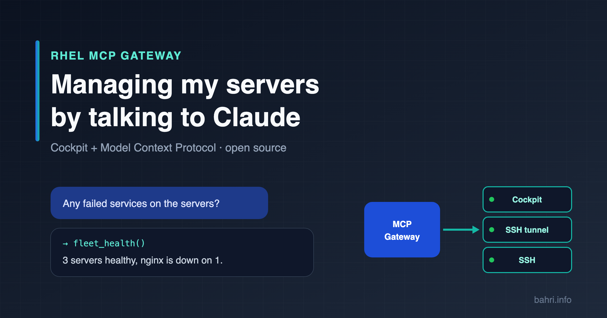

# RHEL MCP Gateway — Technical Overview

**English** · [Türkçe](genel-bakis.md)



| | |
| --- | --- |
| **Document type** | Product and architecture overview |
| **Scope** | The `public-gateway` component |
| **License** | GNU GPL v3 |
| **Source code** | <https://github.com/bmericc/rhel-mcp-gateway> |

## 1. Executive summary

RHEL MCP Gateway is an open-source middle layer that lets AI assistants manage fleets of Linux servers in a secure and controlled way. It brings together the **Cockpit** management interface already used on the servers and the **Model Context Protocol (MCP)**, the common standard of AI clients.

System administrators can query the state of servers, services, logs and updates in natural language and have changes carried out through a confirmation mechanism. The solution does not require installing an extra agent or plugin on the servers; it uses the existing Cockpit and SSH infrastructure.

**Main benefits:**

- **Fast diagnosis:** The health of many servers is collected in parallel with a single question.
- **Controlled change:** Every operation that changes the system is only shown as a preview unless explicitly confirmed.
- **Fits the existing infrastructure:** Authentication and privilege escalation use Cockpit's own mechanisms; there is no separate user database.
- **Flexible network access:** Direct access, SSH tunnel, SSH fallback and proxy options adapt to different network conditions.

## 2. Purpose and scope

The purpose of the gateway is to offer MCP-compatible clients (Claude, Claude Code etc.) a **restricted and auditable** tool set on registered Linux servers.

**In scope:**

- Reading server state: system information, resource usage, services, logs, network, firewall, SELinux, updates.
- Confirmed changes: service management, package installation and removal, updates, firewall rules, reboot, arbitrary commands.
- A web panel for managing the server inventory.

**Out of scope:**

- Installing agents or Cockpit plugins on the servers.
- Replacing configuration management tools (Ansible, Puppet etc.).
- Multi-tenant use.

## 3. Architecture


The gateway is a Python (FastAPI) application running as a single Docker container. It has three main interfaces:

| Interface | Protocol | Used by |
| --- | --- | --- |
| MCP endpoint (`/sse`) | MCP, SSE transport, OAuth 2.1 | AI clients |
| Web panel (`/`) | HTTPS (behind a reverse proxy) | System administrators |
| Server connections | Cockpit WebSocket (`cockpit1`), SSH | Gateway → servers |

### 3.1 Components

| Module | Responsibility |
| --- | --- |
| `main.py` | MCP server, web panel, server inventory, connection selection |
| `auth.py` | Cockpit-based authentication, OAuth 2.1 authorization server |
| `cockpit_client.py` | Cockpit WebSocket protocol client |
| `fleet_tools.py` | MCP tools, input validation, output parsing |
| `outbound_proxy.py` | HTTP CONNECT and SOCKS5 proxy client |
| `audit_log.py` | Audit log of tool calls, panel actions and logins |
| `i18n.py` | Interface language (English by default, Turkish from the browser's `Accept-Language`) |

### 3.2 Connection model

The gateway tries to connect to each server in the following order:

1. **Direct Cockpit:** It connects to the Cockpit address (default `https://HOST:9090`). Administrative operations use Cockpit's superuser mechanism.
2. **Cockpit over an SSH tunnel:** If the Cockpit port cannot be reached from outside, it connects to the server over SSH. A tunnel to the server's own `localhost` Cockpit is opened inside the connection. The Cockpit port therefore does not need to be opened to the outside.
3. **SSH:** If the tunnel cannot be established, commands are run directly over SSH. For non-root users, administrative commands run with `sudo -n`.

A failure of direct Cockpit access is remembered for 10 minutes; during that time the tunnel is used without waiting for needless timeouts. Every tool response states the connection route used (`cockpit`, `cockpit-ssh`, `ssh`).

### 3.3 Network and proxy support

- All connections to the servers can optionally be routed through a proxy (HTTP CONNECT, SOCKS5, SOCKS5h). The proxy can be defined globally or per server.
- The web panel shows the public IP address of the gateway and of the configured proxy, which makes preparing firewall rules easier.

## 4. Authentication and authorization

### 4.1 User login

Logging in to the gateway is verified with the Cockpit account on the machine the gateway runs on (or the configured one). In addition, an **access token** (`MCP_API_KEY`) defined in the configuration is required as a second factor.

- The token alone does not grant access.
- If the token is wrong, the user's password is not passed on to Cockpit.
- `ALLOWED_USERS` restricts which users may access the gateway.

### 4.2 MCP clients

| Method | Description |
| --- | --- |
| OAuth 2.1 (recommended) | Dynamic client registration (RFC 7591), PKCE, refresh token rotation, token revocation, protected resource metadata (RFC 9728). The access token is valid for 1 hour, the refresh token for 30 days. |
| HTTP Basic | The Cockpit username/password and the access token are sent in headers. |

Tokens are stored on the server only as SHA-256 digests. When the access token is changed, all existing sessions become invalid.

### 4.3 Privileges on the servers

The gateway works with the privileges of the Cockpit account defined for each server. For operations that need administrator privileges this account must have sudo rights. The SSH fallback requires passwordless sudo (`sudo -n`).

## 5. Capabilities

### 5.1 Read tools

| Tool | Function |
| --- | --- |
| `list_servers` | Registered servers (passwords hidden) |
| `fleet_health` | Load, failed services and disk summary of all servers (in parallel) |
| `server_info` | Hostname, operating system, kernel, uptime |
| `resource_usage` | Memory, swap, load, CPU, disk usage |
| `service_status` | Service state and latest log lines |
| `failed_services` | Failed systemd units |
| `read_logs` | `journalctl` (unit, time, priority and search filter) |
| `top_processes` | Processes consuming the most resources |
| `network_info` | IP addresses, routes, listening ports |
| `firewall_status` | firewalld state and rules |
| `selinux_status` | SELinux mode and recent denials |
| `available_updates` | Pending (security) updates |
| `package_info` | Package installation state and version |

### 5.2 Change tools

| Tool | Function |
| --- | --- |
| `service_action` | Start, stop, restart, reload, enable, disable a service |
| `install_updates` | Install package updates (optionally security only) |
| `package_install` / `package_remove` | Install and remove packages |
| `firewall_rule` | Add/remove a permanent port or service rule |
| `reboot_server` | Reboot the server |
| `run_remote_command` | Arbitrary command (optionally with administrator privileges) |

Change tools are not executed without the `confirm: true` parameter; in that case only a preview of the operation is returned.

> The package and firewall tools are designed for the RHEL family (`dnf`, `firewalld`). On other distributions these operations can be done with `run_remote_command`.

## 6. Security

### 6.1 Controls in place

| Area | Control |
| --- | --- |
| Authentication | Two factors with the Cockpit account and the access token; list of allowed users |
| Sessions | OAuth 2.1 and PKCE; tokens are stored as digests; sessions are reset when the token changes |
| Secrets | Cockpit passwords, proxy credentials and shared SSH keys are stored encrypted (Fernet) with a key derived from `SECRET_KEY`; file mode `0600` |
| Command safety | Commands are passed as an argv array (no shell interpretation); service, package and port inputs are validated |
| Change control | Changing operations require explicit confirmation |
| Audit | Tool calls, panel actions and logins are written to an audit log and shown in the panel |
| Resource limits | Commands are subject to timeouts (default 60 s, long operations 15 min); outputs are limited to 20,000 characters |
| Network | On a server connection error the gateway fails closed (for example, if the proxy setting cannot be decrypted it does not fall back to a direct connection) |

### 6.2 Known limitations

- TLS certificate verification is off by default for Cockpit connections (because of self-signed certificates). The certificate is not verified for the Cockpit connection inside the SSH tunnel.
- The server key is not verified for SSH connections (`known_hosts` is not used).
- For these reasons the solution is designed on the assumption that the network between the gateway and the servers is trusted.

### 6.3 Recommended operating practices

- `ALLOWED_USERS` should always be set, and the access token should be long and random (e.g. `openssl rand -hex 32`).
- The gateway should be published behind a reverse proxy that terminates HTTPS.
- The Cockpit port should not be opened to the outside on the servers; use the SSH tunnel where possible. If it has to be opened, only the gateway's IP address should be allowed.
- `SECRET_KEY` should be kept secret and not changed; if it changes, stored passwords can no longer be decrypted.

## 7. Installation and operation

**Requirements:**

- Docker and Docker Compose
- A reverse proxy that terminates HTTPS (nginx, Caddy etc.)
- Cockpit (`cockpit.socket`) and/or SSH access on the target servers

**Installation:**

```bash
git clone https://github.com/bmericc/rhel-mcp-gateway
cd rhel-mcp-gateway
cp sample.env .env      # edit the configuration values
docker compose up -d --build
```

**Persistent data** (the `data/` folder):

| File | Contents |
| --- | --- |
| `servers.json` | Server inventory (passwords encrypted) |
| `oauth.json` | OAuth clients and token digests |
| `ssh_keys.json` | Shared SSH keys (encrypted) |
| `audit.log` | Audit log (one JSON object per line) |

For the full list of configuration variables see the [README](../README.md#environment-variables-env).

## 8. Quality assurance

- The code base is verified by more than 200 automated tests. The tests do not connect to real servers; a test server that imitates the behaviour of the real cockpit-ws is used for Cockpit, and fake connections for SSH.
- The OAuth flow, the SSH tunnel and proxy support have additionally been verified against real cockpit-ws and OpenSSH servers.
- GitHub Actions runs the tests on every change; GitGuardian scans for secrets.

## 9. Roadmap

- Package (`apt`) and firewall (`ufw`) tools for the Debian/Ubuntu family.
- SSH host key verification and hardened TLS settings.

## 10. License

This software is licensed under the [GNU General Public License v3](../LICENSE).
